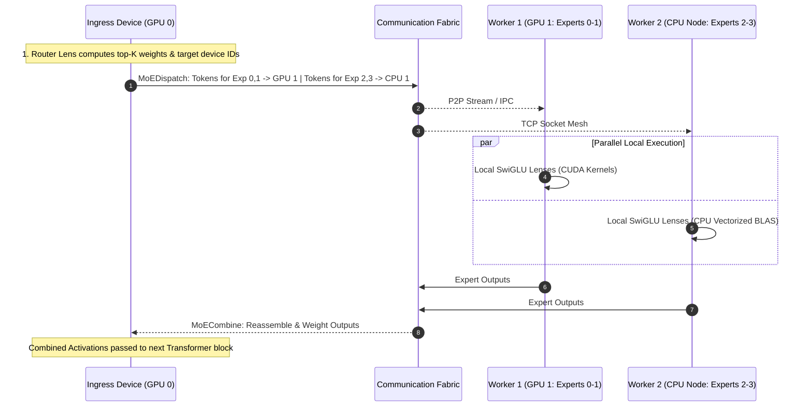
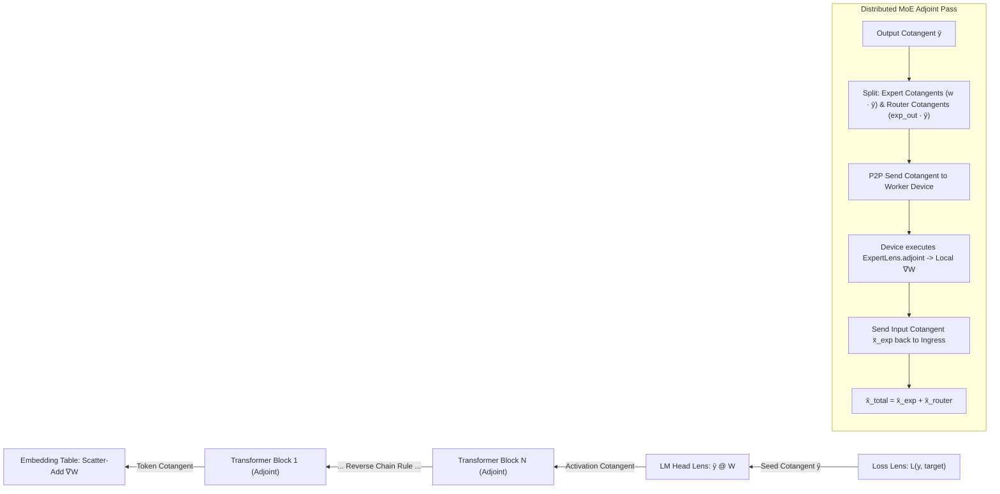

# Double Lenses: Categorical Runtime for Mixtral & DeepSeek

An industrial-grade, category-theoretic neural network runtime based on **Bryce Clarke's PhD thesis**:
> *"The double category of lenses"*, Centre of Australian Category Theory, Macquarie University (2022).

This library formalizes the double category of lenses $\mathbb{L}\mathrm{ens} \cong \Gamma(\mathbb{C}\mathrm{of})$ and implements **forward and adjoint (reverse-mode automatic differentiation)** computations for large open-source Mixture-of-Experts (MoE) architectures—specifically **Mixtral** (Grouped-Query Attention + Top-2 MoE) and **DeepSeek** (Multi-Head Latent Attention + DeepSeekMoE with fine-grained routed and shared experts)—staged across heterogeneous clusters of **multiple GPUs and CPUs**.

---

## 1. Category-Theoretic Foundations

The double category provides two orthogonal dimensions of computation:

```
                   HORIZONTAL AXIS: Cluster Hardware & Sharding (Space)
                Device A (GPU 0) ------------ Functor H ------------> Device B (CPU 1)
                       |                                                     |
 VERTICAL AXIS:        |                                                     |
 Computation &         |                   Double 2-Cell θ                   |
 Adjoint Passes   Lens L_A (Local)         (Staging Invariance)         Lens L_B (Local)
 (Time)                |                                                     |
                       v                                                     v
                Device A (GPU 0) ------------ Functor K ------------> Device B (CPU 1)
```

- **Delta Lenses**: Pairs of a forward functor $f: \mathcal{A} \to \mathcal{B}$ and a lifting cofunctor $\phi: \mathcal{A}_0 \times \mathcal{B}_1 \to \mathcal{A}_1$ satisfying:
  - **(L1)** $f(\phi(a, u)) = u$ (lifts over $u$)
  - **(L2)** $\phi(a, 1_{fa}) = 1_a$ (identity preservation)
  - **(L3)** $\phi(a, v \circ u) = \phi(p(a, u), v) \circ \phi(a, u)$ (chain rule of calculus)
- **Theorem 3.21 (Clarke 2022)**: The double category of lenses $\mathbb{L}\mathrm{ens}$ is isomorphic to the right-connected completion $\Gamma(\mathbb{C}\mathrm{of})$ of the flat double category of cofunctors.
- **Span Representation (Proposition 2.13 & Theorem 3.24)**: Lenses decompose into spans $\mathcal{A} \xleftarrow{\psi} \Lambda(f, \phi) \xrightarrow{f \circ \psi} \mathcal{B}$, storing activation paths in the Category of Chosen Lifts $\Lambda(f, \phi)$ for adjoint pullback.
- **Parameterized Lenses $\mathrm{Para}(\mathbb{L}\mathrm{ens})$**: Neural network layers are morphisms $P \otimes X \to Y$. The adjoint lift computes both activation cotangents $\bar{x} = J_x^T \bar{y}$ and parameter gradients $\nabla_w = J_w^T \bar{y}$.
- **Interchange Law**: Guarantees that composing distributed communication horizontally and neural network layers vertically commutes:
  $$(\theta_{22} \circ_h \theta_{21}) \circ_v (\theta_{12} \circ_h \theta_{11}) = (\theta_{22} \circ_v \theta_{12}) \circ_h (\theta_{21} \circ_v \theta_{11})$$

---

## 2. How Cluster Staging Happens

Staging partitions and maps model components onto physical hardware nodes (NVIDIA CUDA GPUs and multi-threaded CPU workers) using **Double 2-Cells**:



### A. Expert Parallelism (EP) 2-Cells (`ExpertParallel2Cell`)
1. **Routing**: The Ingress device (`node0:cuda:0`) runs `MoERouterLens`. For each token, it computes the top-$K$ expert IDs and normalized gating weights $w$.
2. **Dispatch Functor**: Tokens are bucketed by their destination device (e.g., Experts 0–1 staged on `node0:cuda:0`, Experts 2–3 staged on `node1:cpu:0`). The `CommunicationFabric` serializes token buffers and dispatches them via TCP sockets (inter-node) or direct queues (intra-node).
3. **Local Parallel Execution**: Each worker device unpacks its assigned tokens and executes its local `ExpertLens` concurrently.
4. **Combine Functor**: The worker devices transmit expert outputs back to the Ingress device, which weights and sums them:
   $$y = \sum_{j \in \mathrm{topK}} w_j \cdot \mathrm{expert}_j(x)$$

### B. Tensor Parallelism (TP) 2-Cells (`TensorParallel2Cell`)
- **Column-Parallel Shard**: Divides the weight matrix $W$ along output features across devices.
- **Row-Parallel Shard**: Divides $W$ along input features across devices.
- The two layers are composed with an intermediate `AllReduceFunctor`. The double category verifies that the sharded execution is mathematically isomorphic to centralized execution.

### C. Hierarchical Memory Staging & CPU Offloading (`MemoryStager`)
- When a model (e.g. Mixtral 8x7B or DeepSeek-V3) exceeds GPU VRAM, parameters reside in host CPU RAM.
- **Asynchronous Prefetching**: While layer $L_{k-1}$ is computing on GPU, the parameters for layer $L_k$ are streamed from CPU RAM into GPU VRAM in the background.
- **Eviction & Gradient Sync**: Once layer $L_k$ finishes its forward or adjoint pass, its activations and gradients are offloaded back to CPU RAM.

---

## 3. How Optimization & Adjoint Computations Happen

Optimization in this runtime is the reverse traversal of the double category: **pulling back cotangents through vertical lenses and horizontal communication functors**.



### A. Adjoint Lifting via Parameterized Lenses (`ParameterizedLens`)
- During the forward pass, intermediate activations are cached in the **Category of Chosen Lifts $\Lambda(f, \phi)$** via `LensContext`.
- The terminal loss lens `CrossEntropyLossLens` generates the root cotangent seed:
  $$\bar{y} = \nabla_{\mathrm{logits}} \mathcal{L} = \frac{1}{N} (\mathrm{softmax}(y) - y_{\mathrm{true}})$$
- As this cotangent is pulled back through each lens layer $(f, \phi)$, the cofunctor computes two things simultaneously:
  1. **Activation Cotangent (Pullback to preceding layer)**:
     $$\bar{x} = J_x(w, x)^T \bar{y}$$
  2. **Parameter Gradient (Stored on the device hosting the parameter)**:
     $$\nabla_w = J_w(w, x)^T \bar{y}$$

### B. Adjoint Duality of Cluster Communication
Cluster communication operations in the forward pass have exact adjoint dual functors in the backward pass:

| Forward Pass Communication Functor $H$ | Backward / Adjoint Dual Functor $H^*$ | Implementation |
| :--- | :--- | :--- |
| **`AllGather`** (Concatenates shards across devices) | **`ReduceScatter`** (Sums cotangents and slices shards) | `AllGatherFunctor.adjoint` |
| **`Scatter`** (Splits root tensor to workers) | **`Gather`** (Concatenates worker cotangents onto root) | `ScatterFunctor.adjoint` |
| **`Gather`** (Gathers worker shards onto root) | **`Scatter`** (Splits root cotangent to workers) | `GatherFunctor.adjoint` |
| **`AllReduce`** (Sums tensors across all devices) | **`AllReduce`** (Self-adjoint) | `AllReduceFunctor.adjoint` |

### C. Gradient Accumulation and Parameter Updates
- Gradients $\nabla_w$ accumulate locally on the specific device hosting each expert or shard (no global synchronization needed for expert weights).
- For replicated layers (e.g. attention projections in Data Parallelism), gradients are averaged across devices using `AllReduceFunctor`.
- Parameters are updated via gradient descent or AdamW transitions:
  $$w \leftarrow w - \eta \cdot \frac{\hat{m}}{\sqrt{\hat{v}} + \epsilon}$$
  Because $w$ is an object in the parameter category $\mathcal{P}$, updates are state transitions preserving lens axioms across iterations.

---

## 4. Supported Architectures

### Mixtral 8x7B / 8x22B
- **Grouped-Query Attention (GQA)**: $W_q, W_k, W_v$ projections, RoPE rotary embeddings, scaled causal dot-product attention, and $W_o$ output projection with analytical forward and adjoint lifting.
- **Sparse Mixture of Experts (SMoE)**: Gating router with Top-2 softmax selection, 8 SwiGLU FFN experts, and token gathering/combination.

### DeepSeek-V2 / DeepSeek-V3 / DeepSeek-R1
- **Multi-Head Latent Attention (MLA)**:
  - Low-rank KV compression ($c_t^{KV} = x_t W_{DKV}$), reducing KV cache memory bandwidth.
  - Key/value decompression ($k^C = c^{KV} W_{UK}$, $v^C = c^{KV} W_{UV}$).
  - Decoupled RoPE keys ($k^R = \mathrm{RoPE}(x W_{KR})$) and decoupled query RoPE.
  - Query compression ($c^Q = x W_{DQ}$) and decompression ($q^C = c^Q W_{UQ}$, $q^R = \mathrm{RoPE}(c^Q W_{QR})$).
- **DeepSeekMoE**:
  - Isolated Shared Experts executed on all tokens.
  - Fine-Grained Routed Experts with Top-$K$ selection and device affinity.

---

## 5. Quickstart & CLI

### Run the Cluster Demo
Run both Mixtral and DeepSeek forward & adjoint passes staged across a heterogeneous cluster (1 CUDA GPU + 2 CPU workers):
```bash
python3 -m double_lenses.cli.run_cluster --model both --num-gpus 1 --num-cpus 2 --steps 3
```

### Run the Test Suite
Run all 26 unit and integration tests (category theory, autodiff finite differences, architectures, collectives, and cluster staging):
```bash
python3 run_tests.py
```
